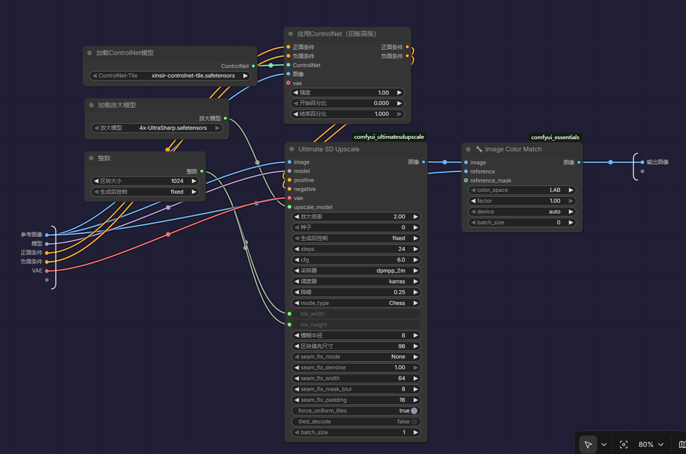
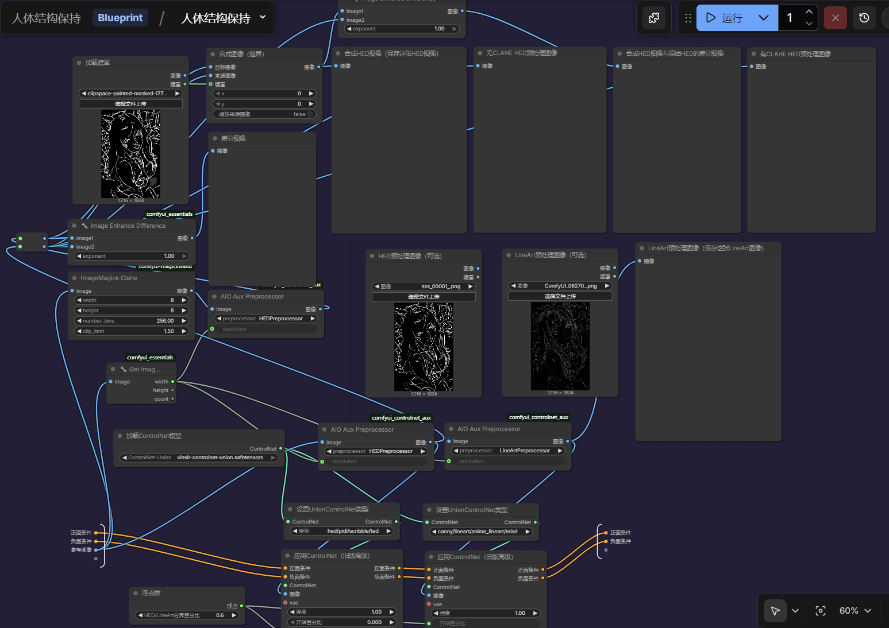
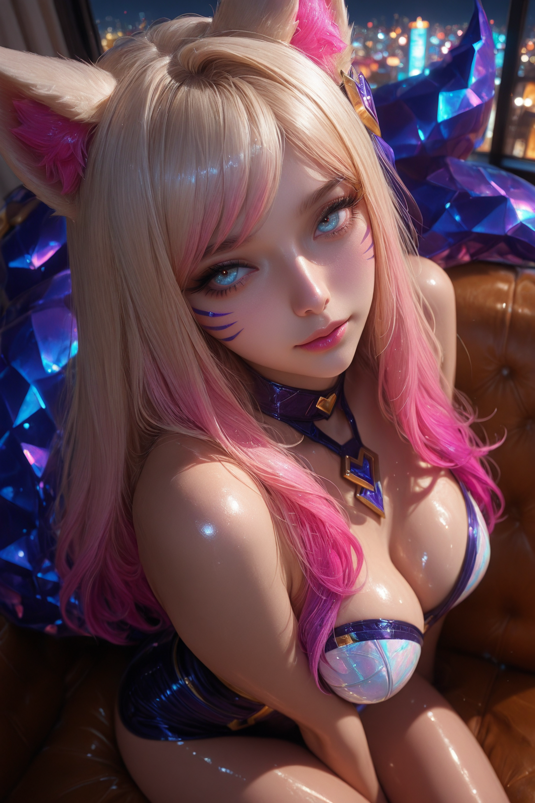
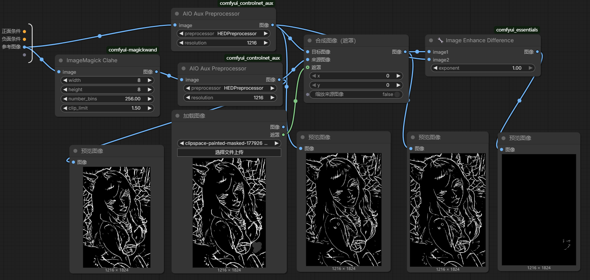

# 介绍

&emsp;&emsp;随便制作的一些子节点

## 高级图像放大

### 说明

&emsp;&emsp;封装了一下ComfyUI_UltimateSDUpscale。我观察到放大后的图像会有色偏，有时候是有益的有时候是有害的。我想了想还是在最后加入了在LAB颜色空间进行的颜色匹配处理。

### 要求

- ComfyUI_UltimateSDUpscale

- ComfyUI_essentials

- 确保至少8G显存可用

### 参数设置

- ControlNet-Tile最好使用xinsir团队的ControlNet-Tile

- 放大模型最好使用4x-UltraSharp

- 采样器和调度器需要根据实际情况调整

- 对于写实图像来说降噪可以调整到更高的数值，比如0.45。对于更加风格化的图像来说，数值可以低一些

- 其余参数已经过多次调试被设置到了合适的值，如步数、CFG、区块填充尺寸等等

## 人体结构保持

### 说明

&emsp;&emsp;专门用于半写实风格到写实风格的迁移的一个子节点，我感觉效果还不错。这个迁移过程是分两阶段控制的，前一阶段由HED单独控制，后一部分由LineArt单独控制。别的边缘控制模式我都试过了，感觉面部都或多或少缺少美感。子节点中默认的0.6分界比例是我测试出来的一个黄金比例。以下是用来对比的两张样例图像。

| 参考图像 | 生成图像 |
| --- | --- |
|  |  |

### 要求

- ComfyUI_essentials

- comfyui_controlnet_aux

- ComfyUI-MagickWand

- ControlNet-Union最好使用xinsir团队的ControlNet-Union

### 使用技巧

&emsp;&emsp;如果半写实参考图中有不太喜欢的内容，可以在Image Canvas中进行编辑，把不需要的内容手动去除。说明部分提到的的两张示例图的面部使用了相关的技巧。

&emsp;&emsp;HED预处理图像有时候会少一点东西，前两张图中的左手就没对应上。可以在子节点左边的"差分图像"节点中利用Mask Editor，使用它自带的吸管和橡皮擦工具选择想添加的缺失结构来创建遮罩，并使用合成图像（遮罩）节点来添加缺失结构。以下是上述措施的流程示意图以及两张相关的示例图。

| 手部修复前 | 手部修复后 |
| --- | --- |
|  |  |

