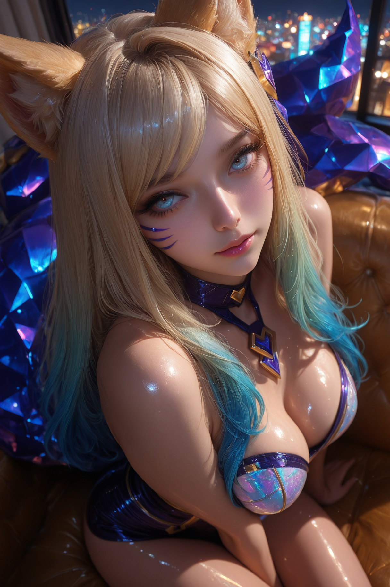

# 介绍

&emsp;&emsp;随便制作的一些子节点

## 高级图像放大

### 说明

&emsp;&emsp;封装了一下ComfyUI_UltimateSDUpscale，许多参数都被我调整了一下。观察到放大后的图像会有色偏，有时候是有益的有时候是有害的。我想了想还是在最后加入了在LAB颜色空间进行的颜色匹配处理。

### 要求

- 需要安装ComfyUI_UltimateSDUpscale和ComfyUI_essentials

- 确保至少8G显存可用

### 参数设置

- ControlNet-Tile最好使用xinsir团队的ControlNet-Tile

- 放大模型最好使用4x-UltraSharp

- 采样器和调度器需要根据实际情况调整

- 其余参数已经过多次调试，如步数、降噪、区块填充尺寸等

&emsp;&emsp;经过一些测试，我观察到放大后的图像会有色偏，有时候有益有时候有害。我想了想还是在最后加入了在LAB颜色空间进行的颜色匹配处理。

## 人体结构保持

### 说明

&emsp;&emsp;专门用于半写实风格到写实风格的迁移的一个子节点，效果还不错。分两阶段控制，前一部分由HED控制，后一部分由LineArt控制。默认的0.6分界比例是我测试出来的一个黄金比例。以下是两张样例图像。

### 要求

- ControlNet-Union最好使用xinsir团队的ControlNet-Union

### 使用技巧

&emsp;&emsp;如果半写实参考图中有不太喜欢的内容，可以把HED预处理图像和LineArt预处理图像保存下来，把这两张图像中不需要的内容手动去除，然后用手动编辑后的预处理图控制生成图。上方的两张示例图的脸部就使用了相关的技巧。

&emsp;&emsp;HED预处理图像和LineArt预处理图像有时候会少一点东西。正如上两张图所示，左手就没对应上。可以使用CLAHE预处理参考图像，接着使用HED预处理图像，然后使用MASK遮罩选择想添加的结构，最后使用合成图像（遮罩）节点，将想添加的结构加入无CLAHE预处理HED预处理的图像中。下面两张图分别展示了相关的操作以及示例演示图像。可以看到做差后的图中只是多出来了手。

